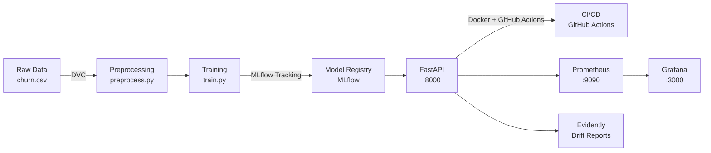

# MLOps Portfolio — Churn Prediction Pipeline

> "J'ai construit un pipeline MLOps complet simulant un cycle de vie de modèle en production — du versioning des données jusqu'au monitoring du drift, avec CI/CD qui valide automatiquement la qualité du modèle avant déploiement."


## Architecture



## Stack

| Composant | Rôle | Pourquoi |
|-----------|------|----------|
| Git + DVC | Versioning data/modèles | DVC versionne les gros fichiers sans les mettre dans Git (contrairement à Git LFS, DVC supporte S3/GDrive nativement) |
| MLflow | Tracking + Model Registry | UI de comparaison de runs, staging/production lifecycle |
| FastAPI | API de serving | Async, type hints natifs, OpenAPI auto-généré |
| Docker Compose | Orchestration locale | Un seul `docker-compose up` lance tout |
| GitHub Actions | CI/CD | Lint → Test → Validation métrique → Build/Push |
| Pytest | Tests | Tests unitaires data, modèle, API |
| Evidently | Drift monitoring | Rapport HTML de distribution shift |
| Prometheus + Grafana | Métriques production | Latence, throughput, erreurs en temps réel |
| Kubernetes (bonus) | Déploiement scalable | Manifestes Deployment + Service prêts |

## Lancement rapide

### Prérequis
- Docker + Docker Compose
- Python 3.11+
- Dataset `churn.csv` dans `data/raw/` ([Telco Customer Churn — Kaggle](https://www.kaggle.com/datasets/blastchar/telco-customer-churn))

### Tout lancer en une commande

```bash
docker-compose up --build
```

Services disponibles :
- API : http://localhost:8000 — docs : http://localhost:8000/docs
- MLflow UI : http://localhost:5000
- Prometheus : http://localhost:9090
- Grafana : http://localhost:3000 (admin/admin)

### Lancement local (développement)

```bash
# 1. Environnement
python -m venv venv
venv\Scripts\activate          # Windows
pip install -r requirements.txt

# 2. Init DVC
dvc init
dvc remote add -d storage ./dvc-storage
dvc add data/raw/churn.csv
git add data/raw/churn.csv.dvc .gitignore .dvc
git commit -m "Init DVC + raw data"

# 3. Pipeline DVC (preprocess + train)
dvc repro

# 4. MLflow server (terminal séparé)
mlflow server --host 0.0.0.0 --port 5000 \
  --backend-store-uri sqlite:///mlflow.db \
  --default-artifact-root ./mlruns

# 5. API
uvicorn src.api.main:app --reload --port 8000

# 6. Tests
pytest tests/ -v

# 7. Rapport de drift
python monitoring/drift_report.py
```

## Endpoints API

| Méthode | Route | Description |
|---------|-------|-------------|
| GET | `/health` | Healthcheck |
| POST | `/predict` | Prédiction churn + probabilité |
| GET | `/model-info` | Version du modèle servi |
| GET | `/metrics` | Métriques Prometheus |

Exemple de requête :

```bash
curl -X POST http://localhost:8000/predict \
  -H "Content-Type: application/json" \
  -d '{
    "SeniorCitizen": 0, "tenure": 12, "MonthlyCharges": 50.0,
    "TotalCharges": 600.0, "gender": 1, "Partner": 1, "Dependents": 0,
    "PhoneService": 1, "MultipleLines": 0, "InternetService": 1,
    "OnlineSecurity": 0, "OnlineBackup": 1, "DeviceProtection": 0,
    "TechSupport": 0, "StreamingTV": 1, "StreamingMovies": 0,
    "Contract": 0, "PaperlessBilling": 1, "PaymentMethod": 2
  }'
```

## CI/CD Pipeline

```
push → main
  ├── lint       (ruff)
  ├── test       (pytest)
  ├── validate-model  (F1 > 0.75 sinon échec)
  └── build-and-push  (ghcr.io)
```

La validation métrique est la différence clé avec un CI/CD classique : un modèle dégradé ne peut pas être déployé.

## Kubernetes (bonus)

```bash
kind create cluster --name mlops-portfolio
kubectl apply -f k8s/deployment.yaml
kubectl apply -f k8s/service.yaml
kubectl get pods
```

## Structure du projet

```
mlops-portfolio/
├── .github/workflows/ci-cd.yml   # Pipeline CI/CD
├── data/raw/                     # Données brutes (DVC)
├── data/processed/               # Données traitées (DVC)
├── src/
│   ├── data/preprocess.py        # Nettoyage + split
│   ├── train.py                  # Entraînement + MLflow
│   ├── evaluate.py               # Évaluation standalone
│   └── api/main.py               # FastAPI serving
├── models/                       # Modèle sérialisé (DVC)
├── tests/                        # Pytest
├── monitoring/
│   ├── drift_report.py           # Evidently
│   ├── prometheus.yml            # Config scraping
│   └── grafana/                  # Dashboards provisionnés
├── scripts/validate_metrics.py   # Quality gate CI
├── k8s/                          # Manifestes Kubernetes
├── dvc.yaml                      # Pipeline DVC
├── docker-compose.yml            # Stack complète
└── Dockerfile                    # Image API
```

## Rollback stratégie

En cas de drift détecté en production :
1. MLflow Model Registry → passer le modèle de `Production` à `Archived`
2. Promouvoir la version précédente (`Staging` → `Production`)
3. Redéployer via `docker-compose up --build` ou `kubectl rollout undo deployment/mlops-api`
